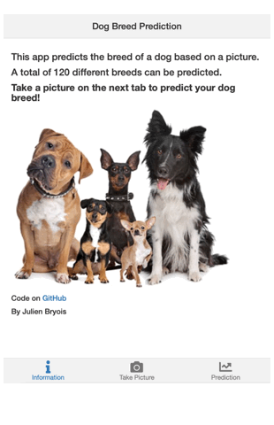

# DogPredict

Shiny app using a fine tuned resnet50 model (deep learning) to predict dog breeds among 120 different species.

The app achieves an 89.5% accuracy on a validation set consisting of 20% of the data.

The original data can be downloaded [here](http://vision.stanford.edu/aditya86/ImageNetDogs/) 

This app will be deployed on [shinyapps.io](https://www.shinyapps.io) when [shinyapps.io](https://www.shinyapps.io) allows the usage of python3.

To use locally:

Install the necessary R packages: 
1. shiny
2. miniUI
3. reticulate
4. ggplot2 

Then run the following code in R. Don't forget to replace "/anaconda3/bin/python" with your path to python3 

reticulate::virtualenv_create(envname = "DogPredict", python= "/anaconda3/bin/python")
reticulate::virtualenv_install("DogPredict", packages = c('torchvision','fastai'))